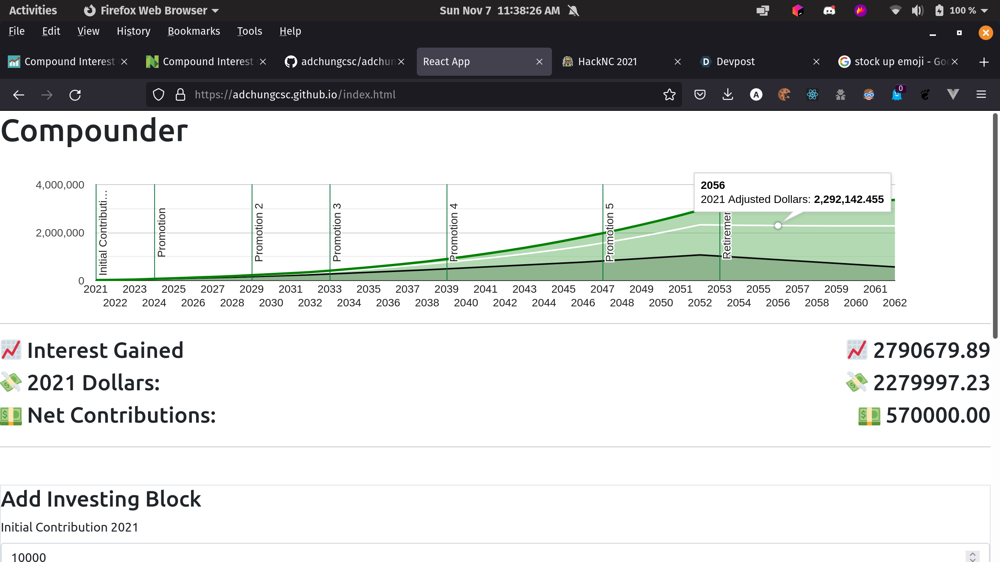

# Compounder

Submission for weekend hackathon at UNC Chapel Hill, HackNC 2021. Responsive front end made using React, Google Charts, & boostrap to help people visualize compounding investment growth and plan out their investing futures as circumstances change.
The calculator can help visualize what happens to your overall investments as rates of inflation, interest, and annual contributions change throughout your life until retirement.
You can see the nominal and real amount gained by the end of the simulated investment period in that year and year of calculation dollars.

